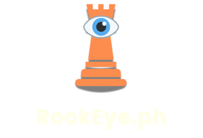

<!-- Improved compatibility of back to top link: See: https://github.com/othneildrew/Best-README-Template/pull/73 -->

<a id="readme-top"></a>

[![Contributors][contributors-shield]][contributors-url]
[![Forks][forks-shield]][forks-url]
[![Stargazers][stars-shield]][stars-url]
[![Issues][issues-shield]][issues-url]
[![MIT License][license-shield]][license-url]

<!-- PROJECT LOGO -->
<br />
<div align="center">
  <a href="https://github.com/alienwolfx/thesis-chess">
    
  </a>

  <p align="center">
    Chess with Computer Vision
    <br />
  </p>
</div>

<!-- TABLE OF CONTENTS -->
<details>
  <summary>Table of Contents</summary>
  <ol>
    <li>
      <a href="#about-the-project">About The Project</a>
      <ul>
        <li><a href="#built-with">Built With</a></li>
      </ul>
    </li>
    <li><a href="#findings">Findings</a></li>
    <li><a href="#license">License</a></li>
    <li><a href="#contact">Contact</a></li>
  </ol>
</details>

<!-- ABOUT THE PROJECT -->

## About The Project

#### Top View


#### Side View


A thesis exploring the Development and Design of a portable chess appliance using YOLOv8.

## Built With

<div align="center">

[![Python][Python]][Python-url] [![OpenCV][OpenCV]][OpenCV-url] [![Qt6][Qt6]][Qt-url]
[![TensorFlow][TensorFlow]][TensorFlow-url] [![PyTorch][PyTorch]][PyTorch-url] [![Pandas][Pandas]][Pandas-url]
[![NumPy][NumPy]][NumPy-url] [![YOLOv8][YOLOv8]][YOLOv8-url]

</div>

## Installation

> [!NOTE]
> Python 3.10 (for pyqt6-tools to work) but it should work with Python 3.12

```bash
# Creating virtual environment (venv)
python -m venv .venv

# Activating venv
.venv/Scripts/activate

# Installing dependencies
pip install -r requirements.txt

# Run
python implementation.py

```

## Findings

Using Roboflow [v26](https://app.roboflow.com/rookeye/rookeye/26) Dataset version we trained a YOLOv8n model using Google Collab with different batch sizes

Batch Size: 32

| Confusion Matrix                              | Results                                |
| --------------------------------------------- | -------------------------------------- |
|  |  |

Batch Size: 64

| Confusion Matrix                              | Results                                |
| --------------------------------------------- | -------------------------------------- |
|  |  |

## License

Distributed under the MIT License. See `LICENSE` for more information.

## Contact

Allen Cruiz - [@cruizallen](https://instagram.com/cruizallen) - <allengabrielle.cruiz@carsu.edu.ph>

Project Link: [https://github.com/alienwolfx/thesis-chess](https://github.com/alienwolfx/thesis-chess)

<!-- MARKDOWN LINKS & IMAGES -->
<!-- https://www.markdownguide.org/basic-syntax/#reference-style-links -->

[contributors-shield]: https://img.shields.io/github/contributors/alienwolfx/thesis-chess.svg?style=for-the-badge
[contributors-url]: https://github.com/alienwolfx/thesis-chess/graphs/contributors
[forks-shield]: https://img.shields.io/github/forks/alienwolfx/thesis-chess.svg?style=for-the-badge
[forks-url]: https://github.com/alienwolfx/thesis-chess/network/members
[stars-shield]: https://img.shields.io/github/stars/alienwolfx/thesis-chess.svg?style=for-the-badge
[stars-url]: https://github.com/alienwolfx/thesis-chess/stargazers
[issues-shield]: https://img.shields.io/github/issues/alienwolfx/thesis-chess.svg?style=for-the-badge
[issues-url]: https://github.com/alienwolfx/thesis-chess/issues
[license-shield]: https://img.shields.io/github/license/alienwolfx/thesis-chess.svg?style=for-the-badge
[license-url]: https://github.com/alienwolfx/thesis-chess/blob/master/LICENSE.txt
[Python]: https://img.shields.io/badge/python-3776AB?style=for-the-badge
[Python-url]: https://www.python.org/
[OpenCV]: https://img.shields.io/badge/OpenCV-5C3EE8?style=for-the-badge
[OpenCV-url]: https://opencv.org/
[Qt6]: https://img.shields.io/badge/Qt6-41CD52?style=for-the-badge
[Qt-url]: https://www.qt.io/
[TensorFlow]: https://img.shields.io/badge/TensorFlow-FF6F00?style=for-the-badge
[TensorFlow-url]: https://www.tensorflow.org/
[PyTorch]: https://img.shields.io/badge/PyTorch-FF0000?style=for-the-badge
[PyTorch-url]: https://pytorch.org/
[Pandas]: https://img.shields.io/badge/Pandas-150458?style=for-the-badge
[Pandas-url]: https://pandas.pydata.org/
[NumPy]: https://img.shields.io/badge/NumPy-013243?style=for-the-badge
[NumPy-url]: https://numpy.org/
[YOLOv8]: https://img.shields.io/badge/YOLOv8-354fed?style=for-the-badge
[YOLOv8-url]: https://www.ultralytics.com/
